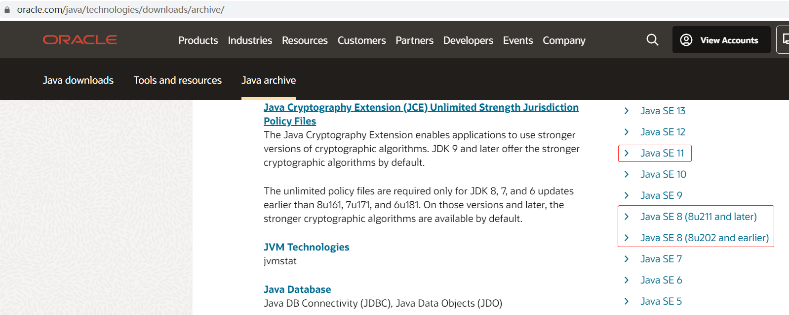

## 安装JDK

### 1、下载jdk安装包

http://java.sun.com/javase/downloads/index.jsp

https://www.oracle.com/java/technologies/downloads/archive/



账号：li1121567428@live.com

### 2、解压安装

```shell
tar -xvf jdk-8u202-linux-x64.tar.gz -C /usr/local/
ln -sv /usr/local/jdk1.8.0_202 /usr/local/jdk
```

### 3、添加到环境变量PATH

```shell
cat <<'EOF' > /etc/profile.d/jdk.sh
export JAVA_HOME=/usr/local/jdk
export JRE_HOME=$JAVA_HOME/jre
export PATH=$PATH:$JAVA_HOME/bin
export CLASSPATH=.:$JAVA_HOME/lib:$JRE_HOME/lib
EOF
source /etc/profile 

java -version
```
