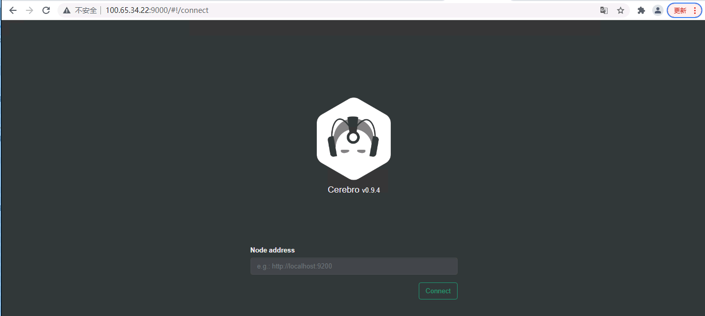

# elasticsearch 7.x 集群部署

## Elasticsearch/ES 

官方的[Elasticsearch Reference](https://www.elastic.co/guide/en/elasticsearch/reference/index.html) 提供了不同版本的文档连接， 中文版 [Elasticsearch 2.x: 权威指南](https://www.elastic.co/guide/cn/elasticsearch/guide/current/index.html)

## 操作系统调优
内存优化
在/etc/sysctl.conf添加如下内容

```shell
cat <<EOF >>/etc/sysctl.conf
fs.file-max=65535
vm.max_map_count=262144
vm.swappiness=1
EOF

sysctl -p
```

修改limits.conf配置文件
```shell
cat <<EOF >> /etc/security/limits.conf
* soft nofile 65535
* hard nofile 65535
* soft nproc 65535
* hard nproc 65535
* soft memlock unlimited
* hard memlock unlimited
EOF

ulimit -n 65535 
ulimit -u 65535
```

## 安装JDK
```shell
yum install -y java-11-openjdk
```

## 下载 ES 安装包

安装包下载地址：

- [官方-Past Releases](https://www.elastic.co/cn/downloads/past-releases#elasticsearch) 官网的下载速度龟速
- [华为镜像站](https://mirrors.huaweicloud.com/elasticsearch/) 下载速度不错，推荐

```shell
[root@es-uat-0 opt]# ls
elasticsearch-7.6.2-linux-x86_64.tar.gz  elasticsearch-7.6.2-linux-x86_64.tar.gz.sha512  rh
[root@es-uat-0 opt]# shasum -a 512 -c elasticsearch-7.6.2-linux-x86_64.tar.gz.sha512 
elasticsearch-7.6.2-linux-x86_64.tar.gz: OK
```

## 解压安装ES

```shell
# 创建app用户运行ES
groupadd -g 1001 app
useradd -u 1001 -g 1001 app
mkdir -p /data
chown app:app -R /data

# 切换到app用户执行安装
su - app && cd /data
wget https://artifacts.elastic.co/downloads/elasticsearch/elasticsearch-7.10.0-linux-x86_64.tar.gz
curl -L -O https://artifacts.elastic.co/downloads/elasticsearch/elasticsearch-7.10.2-linux-x86_64.tar.gz
tar -xvf elasticsearch-7.10.0-linux-x86_64.tar.gz -C /data/

ulimit -n 65535 
ulimit -u 65535

cd /data/elasticsearch-7.6.2/
$ vim config/elasticsearch.yml 
$ cat config/elasticsearch.yml |grep -v "^#"
cluster.name: es-uat-cluster
node.name: es-uat-0
path.data: /data/es/data
path.logs: /data/es/logs
network.host: 10.10.34.28
http.port: 9200
cluster.initial_master_nodes: ["es-uat-0"]
$ mkdir -p /data/es/data /data/es/logs
$ ./bin/elasticsearch
```

## 单主机启动测试


## 集群配置

```shell
$ cat config/elasticsearch.yml |grep -v "^#"
cluster.name: es-uat-cluster
node.name: es-uat-0           # 配置主机名，其余两台配置es-uat-1/es-uat-2
path.data: /data/es/data
path.logs: /data/es/logs
network.host: 10.10.34.28    # 配置自己IP，其余两台配置10.10.34.33/10.10.34.34
http.port: 9200
discovery.seed_hosts: ["10.10.34.28", "10.10.34.33", "10.10.34.34"]
cluster.initial_master_nodes: ["es-uat-0", "es-uat-1", "es-uat-2"]

node.master: true
node.voting_only: false
node.data: true
node.ingest: true
node.ml: false
xpack.ml.enabled: true
cluster.remote.connect: false

bootstrap.memory_lock: true
```
集群健康检查

```shell
[root@ansible ~]# curl -XGET http://10.10.34.28:9200/
{
  "name" : "es-uat-0",
  "cluster_name" : "es-uat-cluster",
  "cluster_uuid" : "QHiK-a9lT02Ow2S3k2OHuQ",
  "version" : {
    "number" : "7.6.2",
    "build_flavor" : "default",
    "build_type" : "tar",
    "build_hash" : "ef48eb35cf30adf4db14086e8aabd07ef6fb113f",
    "build_date" : "2020-03-26T06:34:37.794943Z",
    "build_snapshot" : false,
    "lucene_version" : "8.4.0",
    "minimum_wire_compatibility_version" : "6.8.0",
    "minimum_index_compatibility_version" : "6.0.0-beta1"
  },
  "tagline" : "You Know, for Search"
}

[root@ansible ~]# curl -XGET http://10.10.34.28:9200/_cluster/health?pretty
{
  "cluster_name" : "es-uat-cluster",
  "status" : "yellow",
  "timed_out" : false,
  "number_of_nodes" : 3,
  "number_of_data_nodes" : 3,
  "active_primary_shards" : 9,
  "active_shards" : 25,
  "relocating_shards" : 0,
  "initializing_shards" : 0,
  "unassigned_shards" : 7,
  "delayed_unassigned_shards" : 0,
  "number_of_pending_tasks" : 0,
  "number_of_in_flight_fetch" : 0,
  "task_max_waiting_in_queue_millis" : 0,
  "active_shards_percent_as_number" : 78.125
}

[root@ansible ~]# curl -XGET http://10.10.34.28:9200/_cluster/state?pretty|less

[root@ansible ~]# curl -XGET http://10.10.34.28:9200/_cluster/stats?pretty

[root@ansible ~]# curl -XGET http://10.10.34.28:9200/_cat/nodes
10.10.34.28 17 37 0 0.05 0.03 0.05 dilm - es-uat-0
10.10.34.34 34 37 0 0.00 0.02 0.05 dilm - es-uat-2
10.10.34.33 31 42 0 0.00 0.01 0.05 dilm * es-uat-1

[root@ansible ~]# curl -XGET http://10.10.34.28:9200/_cat/master
XMzO4wAeQD-HdLdB3CZGJQ 10.10.34.33 10.10.34.33 es-uat-1
[root@ansible ~]# curl -XGET http://10.10.34.28:9200/_cat/master?v
id                     host         ip           node
XMzO4wAeQD-HdLdB3CZGJQ 10.10.34.33 10.10.34.33 es-uat-1

curl -XGET 'http://10.10.34.28:9200/_nodes/server1/stats/jvm?pretty&human'
curl -XGET 'http://10.10.34.28:9200/_nodes?pretty&filter_path=**.mlockall'
```

通过ElasticSearch-head 打开http://10.10.34.34:9200/


## Windows的Chrome 插件ElasticSearch-head 离线安装

1、下载插件
https://github.com/TravisTX/elasticsearch-head-chrome


## 安装 Cerebro

https://github.com/lmenezes/cerebro

```shell
# unzip cerebro-0.9.4.zip 
# cd cerebro-0.9.4/bin/
# ./cerebro 
[info] play.api.Play - Application started (Prod) (no global state)
[info] p.c.s.AkkaHttpServer - Listening for HTTP on /0:0:0:0:0:0:0:0:9000
```

http://10.10.34.34:9200/




# Elasticsearch安全策略-开启密码账号访问

 验证当前版本是否支持安全功能
Elasticsearch的安全策略需要X-Pack插件的支持，不过对于7.X以上版本X-Pack已经内置，所以不需要额外的操作。

而关于安全功能的支持，根据官方的购买说明(https://www.elastic.co/cn/subscriptions) 除了开源版之外其他版本都支持安全策略。

## 是否打开安全设置

`xpack.security.enabled`控制安全配置的开启，在默认情况下此参数被设置为`false`。要想开启安全策略需要在**所有**集群中讲此参数进行设置

```shell
xpack.security.enabled = true
```

## 配置节点间通讯传输的安全性

仅仅开启安全设置再启动服务的时候会抛出错误

```shell
[2]: Transport SSL must be enabled if security is enabled on a [basic] license. Please set [xpack.security.transport.ssl.enabled] to [true] or disable security by setting [xpack.security.enabled] to [false]
```


这是因为传输网络层用于集群中节点之间的内部通信。启用安全功能后，必须使用TLS来确保节点之间的通信已加密。为节点间通讯配置安全策略需要两个步骤：

## 生成节点间安全策略使用的证书

修改各个节点的安全配置

3. 1 创建证书颁发机构以及为节点生成证书
在Elasticsearch集群中验证证书真实性的推荐方法是信任签署证书的证书颁发机构（CA）。这样，将节点添加到群集后，它们只需要使用由同一CA签名的证书，即可自动允许该节点加入群集。另外证书中可以包含与节点的IP地址和DNS名称相对应的主题备用名称
，以便可以执行主机名验证。

*为Elasticsearch集群创建发证机构

使用下面的步骤为集群创建一个CA授权证书，

```shell
$ ./bin/elasticsearch-certutil ca
```

```shell
[app@es-uat-0 elasticsearch-7.6.2]$ ./bin/elasticsearch-certutil ca
future versions of Elasticsearch will require Java 11; your Java version from [/usr/local/jdk1.8.0_202/jre] does not meet this requirement
This tool assists you in the generation of X.509 certificates and certificate
signing requests for use with SSL/TLS in the Elastic stack.

The 'ca' mode generates a new 'certificate authority'
This will create a new X.509 certificate and private key that can be used
to sign certificate when running in 'cert' mode.

Use the 'ca-dn' option if you wish to configure the 'distinguished name'
of the certificate authority

By default the 'ca' mode produces a single PKCS#12 output file which holds:
    * The CA certificate
    * The CA's private key

If you elect to generate PEM format certificates (the -pem option), then the output will
be a zip file containing individual files for the CA certificate and private key

Please enter the desired output file [elastic-stack-ca.p12]: 
Enter password for elastic-stack-ca.p12 :  # 密码estest123
[app@es-uat-0 elasticsearch-7.6.2]$ ls
bin  config  data  elastic-stack-ca.p12  jdk  lib  LICENSE.txt  logs  modules  NOTICE.txt  plugins  README.asciidoc

```

**为Elasticsearch集群中的节点生成证书**

```shell
[app@es-uat-0 elasticsearch-7.6.2]$ ./bin/elasticsearch-certutil cert --ca elastic-stack-ca.p12 

```


```shell
[app@es-uat-0 elasticsearch-7.6.2]$ ./bin/elasticsearch-certutil cert --ca elastic-stack-ca.p12 
future versions of Elasticsearch will require Java 11; your Java version from [/usr/local/jdk1.8.0_202/jre] does not meet this requirement
This tool assists you in the generation of X.509 certificates and certificate
signing requests for use with SSL/TLS in the Elastic stack.

The 'cert' mode generates X.509 certificate and private keys.
    * By default, this generates a single certificate and key for use
       on a single instance.
    * The '-multiple' option will prompt you to enter details for multiple
       instances and will generate a certificate and key for each one
    * The '-in' option allows for the certificate generation to be automated by describing
       the details of each instance in a YAML file

    * An instance is any piece of the Elastic Stack that requires an SSL certificate.
      Depending on your configuration, Elasticsearch, Logstash, Kibana, and Beats
      may all require a certificate and private key.
    * The minimum required value for each instance is a name. This can simply be the
      hostname, which will be used as the Common Name of the certificate. A full
      distinguished name may also be used.
    * A filename value may be required for each instance. This is necessary when the
      name would result in an invalid file or directory name. The name provided here
      is used as the directory name (within the zip) and the prefix for the key and
      certificate files. The filename is required if you are prompted and the name
      is not displayed in the prompt.
    * IP addresses and DNS names are optional. Multiple values can be specified as a
      comma separated string. If no IP addresses or DNS names are provided, you may
      disable hostname verification in your SSL configuration.

    * All certificates generated by this tool will be signed by a certificate authority (CA).
    * The tool can automatically generate a new CA for you, or you can provide your own with the
         -ca or -ca-cert command line options.

By default the 'cert' mode produces a single PKCS#12 output file which holds:
    * The instance certificate
    * The private key for the instance certificate
    * The CA certificate

If you specify any of the following options:
    * -pem (PEM formatted output)
    * -keep-ca-key (retain generated CA key)
    * -multiple (generate multiple certificates)
    * -in (generate certificates from an input file)
then the output will be be a zip file containing individual certificate/key files

Enter password for CA (elastic-stack-ca.p12) :   # 输入密码estest123
Please enter the desired output file [elastic-certificates.p12]: 
Enter password for elastic-certificates.p12 :  # 密码estest123

Certificates written to /data/elasticsearch-7.6.2/elastic-certificates.p12

This file should be properly secured as it contains the private key for 
your instance.

This file is a self contained file and can be copied and used 'as is'
For each Elastic product that you wish to configure, you should copy
this '.p12' file to the relevant configuration directory
and then follow the SSL configuration instructions in the product guide.

For client applications, you may only need to copy the CA certificate and
configure the client to trust this certificate.
[app@es-uat-0 elasticsearch-7.6.2]$ ls
bin  config  data  elastic-certificates.p12  elastic-stack-ca.p12  jdk  lib  LICENSE.txt  logs  modules  NOTICE.txt  plugins  README.asciidoc


```

默认情况下，`elasticsearch-certutil`生成的证书中没有主机名信息。这意味着可以为集群中的任意节点使用此证书，但是必须关闭主机名验证。

修改每个节点的elasticsearch.yml配置
将elastic-stack-ca.p12文件(只需要此文件)复制到每个节点上的Elasticsearch配置目录中的一个目录中。比如我是放到了每个节点的config/certs目录下。

```shell
$ mkdir config/certs
$ cp elastic-certificates.p12 config/certs/
$ rsync -avP config/certs root@10.10.34.34:/data/elasticsearch-7.6.2/config/
$ rsync -avP config/certs root@10.10.34.33:/data/elasticsearch-7.6.2/config/
```


然后修改每个节点的elasticsearch.yml配置。添加下面的参数

```shell
cat <<EOF >> config/elasticsearch.yml 

xpack.security.transport.ssl.enabled: true
xpack.security.transport.ssl.verification_mode: certificate  
xpack.security.transport.ssl.keystore.path: certs/elastic-certificates.p12   
xpack.security.transport.ssl.truststore.path: certs/elastic-certificates.p12  
EOF
```

xpack.security.transport.ssl.verification_mode

如果在elasticsearch-certutil cert命令中使用—dns或—ip选项，并且希望启用严格的主机名检查，此参数需要设置为full。而之前的例子证书中并没有输入ip以及dns等信息，所以我们没有使用严格的主机检查。

## 将 PKCS#12 文件的密码存储在 Elasticsearch 密钥库中。

集群每个节点都要执行

```shell
./bin/elasticsearch-keystore create 
./bin/elasticsearch-keystore add xpack.security.transport.ssl.keystore.secure_password
./bin/elasticsearch-keystore add xpack.security.transport.ssl.truststore.secure_password


$ ./bin/elasticsearch-keystore add xpack.security.transport.ssl.truststore.secure_password
future versions of Elasticsearch will require Java 11; your Java version from [/usr/local/jdk1.8.0_202/jre] does not meet this requirement
Setting xpack.security.transport.ssl.truststore.secure_password already exists. Overwrite? [y/N]y
Enter value for xpack.security.transport.ssl.truststore.secure_password: # 这里输入密码estest123


# 移除密码
./bin/elasticsearch-keystore remove xpack.security.transport.ssl.truststore.secure_password
```

https://www.elastic.co/guide/en/elasticsearch/reference/7.6/encrypting-internode.html

## 启动[Elasticsearch](https://www.elastic.co/guide/en/elasticsearch/reference/7.6/starting-elasticsearch.html)

```shell
./bin/elasticsearch
```


## 配置内置用户的密码

https://www.elastic.co/guide/en/elasticsearch/reference/7.6/built-in-users.html#set-built-in-user-passwords

```shell
[app@es-uat-0 elasticsearch-7.6.2]$ bin/elasticsearch-setup-passwords interactive
future versions of Elasticsearch will require Java 11; your Java version from [/usr/local/jdk1.8.0_202/jre] does not meet this requirement
Initiating the setup of passwords for reserved users elastic,apm_system,kibana,logstash_system,beats_system,remote_monitoring_user.
You will be prompted to enter passwords as the process progresses.
Please confirm that you would like to continue [y/N]y


Enter password for [elastic]:   # 设置密码 estest123
Reenter password for [elastic]: 
Enter password for [apm_system]: 
Reenter password for [apm_system]: 
Enter password for [kibana]: 
Reenter password for [kibana]: 
Enter password for [logstash_system]: 
Reenter password for [logstash_system]: 
Enter password for [beats_system]: 
Reenter password for [beats_system]: 
Enter password for [remote_monitoring_user]: 
Reenter password for [remote_monitoring_user]: 
Changed password for user [apm_system]
Changed password for user [kibana]
Changed password for user [logstash_system]
Changed password for user [beats_system]
Changed password for user [remote_monitoring_user]
Changed password for user [elastic]
[app@es-uat-0 elasticsearch-7.6.2]$ 

```

## ssl/authc 配置

```shell
[app@es-uat-0 elasticsearch-7.6.2]$ grep -vE "^#|^$" config/elasticsearch.yml
cluster.name: es-uat-cluster
node.name: es-uat-0
path.data: /data/es/data
path.logs: /data/es/logs
network.host: 10.10.34.28
http.port: 9200
discovery.seed_hosts: ["10.10.34.28", "10.10.34.33", "10.10.34.34"]
cluster.initial_master_nodes: ["es-uat-0", "es-uat-1", "es-uat-2"]

http.cors.enabled: true
http.cors.allow-origin: "*"
http.cors.allow-headers: Authorization,X-Requested-With,Content-Type,Content-Length
xpack.security.enabled: true
xpack.security.authc.accept_default_password: true

xpack.security.transport.ssl.enabled: true
xpack.security.transport.ssl.verification_mode: certificate 
xpack.security.transport.ssl.keystore.path: certs/elastic-certificates.p12   
xpack.security.transport.ssl.truststore.path: certs/elastic-certificates.p12
```

https://www.elastic.co/guide/en/elasticsearch/reference/7.6/configuring-tls.html#node-certificates

## ES-head访问认证的ES

http://10.10.34.33:9200/?auth_user=elastic&auth_password=estest123


# 在集群上设置TLS

开启TLS认证：

https://www.elastic.co/guide/en/elasticsearch/reference/7.6/ssl-tls.html

## 加密集群节点之间通讯

https://www.elastic.co/guide/en/elasticsearch/reference/7.6/configuring-tls.html#node-certificates

```yaml
pack.security.transport.ssl.enabled: true
xpack.security.transport.ssl.verification_mode: certificate 
xpack.security.transport.ssl.key: /home/es/config/node01.key 
xpack.security.transport.ssl.certificate: /home/es/config/node01.crt 
xpack.security.transport.ssl.certificate_authorities: [ "/home/es/config/ca.crt" ] 
```

```shell
bin/elasticsearch-keystore add xpack.security.transport.ssl.secure_key_passphrase
```

## 加密http客户端通信

https://www.elastic.co/guide/en/elasticsearch/reference/7.6/configuring-tls.html#tls-http

https://www.golinuxcloud.com/enable-https-ssl-secure-elasticsearch-linux/

```yaml
xpack.security.http.ssl.enabled: true
xpack.security.http.ssl.key:  /home/es/config/node1_http.key 
xpack.security.http.ssl.certificate: /home/es/config/node1_http.crt 
xpack.security.http.ssl.certificate_authorities: [ "/home/es/config/ca.crt" ] 
```

```shell
bin/elasticsearch-keystore add xpack.security.http.ssl.secure_key_passphrase
```

## 配置文件
```shell
[app@es-uat-0 elasticsearch-7.6.2]$ grep -vE "^#|^$" config/elasticsearch.yml
cluster.name: es-uat-cluster
node.name: es-uat-0
path.data: /data/es/data
path.logs: /data/es/logs
network.host: 10.10.34.28
http.port: 9200
discovery.seed_hosts: ["10.10.34.28", "10.10.34.33", "10.10.34.34"]
cluster.initial_master_nodes: ["es-uat-0", "es-uat-1", "es-uat-2"]

#开启账号认证
http.cors.enabled: true
http.cors.allow-origin: "*"
http.cors.allow-headers: Authorization,X-Requested-With,Content-Type,Content-Length
xpack.security.enabled: true
xpack.security.authc.accept_default_password: true

# 加密集群节点之间通讯
xpack.security.transport.ssl.enabled: true
xpack.security.transport.ssl.verification_mode: certificate 
xpack.security.transport.ssl.key: "certs/http-example.com.key"
xpack.security.transport.ssl.certificate: "certs/http-example.com.crt"
xpack.security.transport.ssl.certificate_authorities: "certs/ca.crt" 

# 加密http客户端通信
xpack.security.http.ssl.enabled: true
xpack.security.http.ssl.certificate: "certs/http-example.com.crt"
xpack.security.http.ssl.key: "certs/http-example.com.key"
xpack.security.http.ssl.certificate_authorities: "certs/ca.crt"
```


https://10.10.34.34:9200/?auth_user=elastic&auth_password=estest123


g
