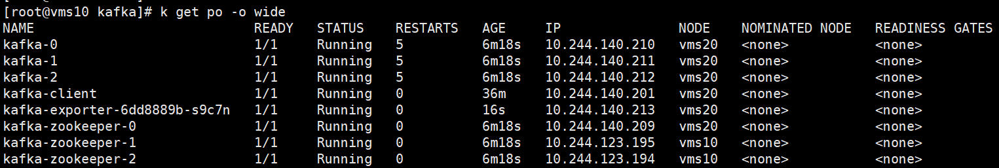

## helm部署kafka

https://bitnami.com/stack/kafka/helm

```shell
# helm repo add bitnami https://charts.bitnami.com/bitnami
# helm search repo bitnami/kafka -l
# helm pull  bitnami/kafka --version 14.9.3
# k create ns kafka
# kubens kafka
# tar -xvf kafka-14.9.3.tgz
# cd kafka/
```

修改charts/zookeeper/values.yaml 和 values.yaml

```shell
[root@vms10 kafka]# helm install kafka .
NAME: kafka
LAST DEPLOYED: Fri Jun 17 11:28:49 2022
NAMESPACE: kafka
STATUS: deployed
REVISION: 1
TEST SUITE: None
NOTES:
CHART NAME: kafka
CHART VERSION: 14.9.3
APP VERSION: 2.8.1

** Please be patient while the chart is being deployed **

Kafka can be accessed by consumers via port 9092 on the following DNS name from within your cluster:

    kafka.kafka.svc.cluster.local

Each Kafka broker can be accessed by producers via port 9092 on the following DNS name(s) from within your cluster:

    kafka-0.kafka-headless.kafka.svc.cluster.local:9092
    kafka-1.kafka-headless.kafka.svc.cluster.local:9092
    kafka-2.kafka-headless.kafka.svc.cluster.local:9092

To create a pod that you can use as a Kafka client run the following commands:

    kubectl run kafka-client --restart='Never' --image docker.io/bitnami/kafka:2.8.1-debian-10-r99 --namespace kafka --command -- sleep infinity
    kubectl exec --tty -i kafka-client --namespace kafka -- bash

    PRODUCER:
        kafka-console-producer.sh \
            
            --broker-list kafka-0.kafka-headless.kafka.svc.cluster.local:9092,kafka-1.kafka-headless.kafka.svc.cluster.local:9092,kafka-2.kafka-headless.kafka.svc.cluster.local:9092 \
            --topic test

    CONSUMER:
        kafka-console-consumer.sh \
            
            --bootstrap-server kafka.kafka.svc.cluster.local:9092 \
            --topic test \
            --from-beginning
```



测试

```shell
kubectl run kafka-client --restart='Never' --image docker.io/bitnami/kafka:2.8.1-debian-10-r99 --namespace kafka --command -- sleep infinity
 
生产
# kubectl exec --tty -i kafka-client --namespace kafka -- bash
I have no name!@kafka-client:/$ kafka-console-producer.sh --broker-list kafka-0.kafka-headless.kafka.svc.cluster.local:9092,kafka-1.kafka-headless.kafka.svc.cluster.local:9092,kafka-2.kafka-headless.kafka.svc.cluster.local:9092  --topic test

消费
# kubectl exec --tty -i kafka-client --namespace kafka -- bash
I have no name!@kafka-client:/$ kafka-console-consumer.sh --bootstrap-server kafka.kafka.svc.cluster.local:9092 --topic test --from-beginning
```

